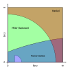

# ComplexBessel
 Complex Bessel Function Numerical Evaluation Note
 
## Im(z) &lt; 0
Complex Bessel functions are analytically connected so that they are complex conjugate symmetrically about the real axis.

  

[DLMF 10.11](https://dlmf.nist.gov/10.11)  
[DLMF 10.34](https://dlmf.nist.gov/10.34)  
 
## Re(z) &lt; 0, Im(z) &geq; 0
Complex Bessel functions are defined to be discontinuous on the negative real axis.

  
  
  
  
  
  

[DLMF 10.11](https://dlmf.nist.gov/10.11)  
[DLMF 10.34](https://dlmf.nist.gov/10.34)  

## Re(z) &geq; 0, Im(z) &geq; 0, Asymptotic Expansion

  
  

  
  
  
  
  
  

[DLMF 10.17](https://dlmf.nist.gov/10.17)  
[DLMF 10.40](https://dlmf.nist.gov/10.40)  

## Numerical Evaluation Stability

|BesselJ, BesselY|BesselI|BesselK|
|---|---|---|
||||

## Connection Formula

  
  
  

[DLMF 10.27](https://dlmf.nist.gov/10.27)  
 
## Reference
[DLMF](https://dlmf.nist.gov/10)  
[Wolfram Math World](https://mathworld.wolfram.com/BesselFunction.html)

## Author

[T.Yoshimura](https://github.com/tk-yoshimura)
